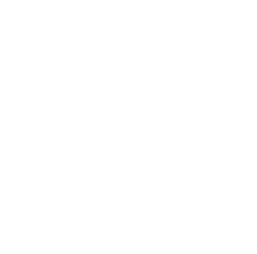

<p align="center">
  
</p>

<h1 align="center">MindVault AI</h1>

<p align="center">
  <strong>Save anything. Find everything.</strong>
</p>

<p align="center">
  A personal knowledge vault for capturing, organizing, and rediscovering the things worth remembering.
</p>

<p align="center">
  <a href="#demo">Demo</a> ·
  <a href="#the-problem">Problem</a> ·
  <a href="#the-idea">Idea</a> ·
  <a href="#current-features">Features</a> ·
  <a href="#tech-stack">Tech Stack</a> ·
  <a href="#local-development">Setup</a> ·
  <a href="#roadmap">Roadmap</a>
</p>

---

## Demo


**Full walkthrough:** [docs/assets/mindVault-introVideo.mov](docs/assets/mindVault-introVideo.mov) (~8.6 MB, ~20 seconds)

GitHub does not reliably stream `.mov` files inline in the README. Clone the repository and open the file locally for the full recording (including audio). The animated preview above shows the first few seconds of the app experience.

---

## The Problem

We already save things everywhere — just not in one place built for keeping knowledge.

A useful link gets sent to ourselves on WhatsApp. A code snippet ends up in Notes. An explanation stays buried in a ChatGPT conversation. A tutorial goes into YouTube Watch Later. A repo gets bookmarked on GitHub. An idea becomes a screenshot we may never open again.

Most of us do this constantly:

- messaging links and ideas to ourselves on WhatsApp
- using “Message Yourself” as temporary storage
- forwarding something to a friend just to find it later
- taking screenshots and forgetting about them
- keeping random browser bookmarks
- copying information into notes apps
- leaving useful browser tabs open
- saving AI responses somewhere ad hoc

The problem is not that we *cannot* save information. The problem is that our knowledge becomes **scattered**:

```
WhatsApp → Notes → Screenshots → Bookmarks → ChatGPT → GitHub → YouTube → Random documents
```

Weeks later, we remember that we saved something — but not **where** we saved it.

The apps above are where knowledge often lives today. They are **not** integrated with MindVault. They illustrate the behavior MindVault is designed to solve.

---

## The Idea

**What if the things worth remembering had one home?**

MindVault gives useful knowledge one personal vault — a private place to capture what matters and organize it by type and category.

**What works today:** sign in, capture notes/links/quotes/code/articles, assign categories, browse and filter your vault, edit or delete entries, and see real dashboard statistics for what you have saved.

**What comes next:** AI-assisted understanding and retrieval — helping you organize smarter and find things by meaning, not just by remembering which app you used.

That longer-term vision is the direction. The current build is the secure foundation: capture once, keep it organized, and browse it in one place.

---

## Current Features

Verified against the current codebase:

### Authentication and access
- User registration and sign-in
- bcrypt password hashing
- HMAC-signed, HTTP-only session cookies (`mindvault_session`)
- Server-side route protection for the vault
- Per-user data isolation on all notes and categories

### Knowledge capture and management
- **Capture** flow for saving new knowledge (`/vault/capture`)
- **Notes CRUD** with ownership-scoped API routes
- **Note detail** with read, inline edit, and delete
- **All Notes** browsing with pagination
- Keyword search on the All Notes page (title and content)
- Filter by note type and category
- Sort by updated date, created date, or title

### Organization
- **Categories CRUD** with per-user names and note counts
- Assign or clear a category when capturing or editing
- Uncategorized notes supported

### Dashboard
- Real authenticated-user statistics (total notes, categories, links, quotes, code snippets)
- Recent notes and recently edited previews
- Category breakdown with note counts
- Empty-state onboarding for new vaults
- Non-functional AI Insight preview card (placeholder copy only)

### Experience
- Four-screen cinematic intro at `/`
- Dark, minimal vault shell with sidebar (desktop) and bottom navigation (mobile)
- Responsive layout across dashboard, notes, categories, and capture
- Framer Motion transitions

### Knowledge types

Supported note types (from the Prisma schema):

| Type    | Purpose                          |
|---------|----------------------------------|
| Note    | General thoughts and ideas       |
| Link    | Saved URLs and references        |
| Quote   | Quotes worth keeping             |
| Code    | Code snippets                    |
| Article | Longer article-style saves       |
| Other   | Anything that does not fit above |

### Placeholder routes (navigation shell only)

These routes exist in the UI but are **not** functional yet:

- `/vault/search` — dedicated global search page
- `/vault/chat` — AI chat
- `/vault/settings` — account and preferences
- Top-bar vault search field (read-only preview)

---

## Tech Stack

| Layer | Technology |
|-------|------------|
| Framework | [Next.js 16](https://nextjs.org) (App Router) |
| UI | [React 19](https://react.dev), [TypeScript](https://www.typescriptlang.org) |
| Styling | [Tailwind CSS 4](https://tailwindcss.com) |
| Components | [shadcn/ui](https://ui.shadcn.com) patterns, [Radix UI](https://www.radix-ui.com), [Lucide](https://lucide.dev) icons |
| Motion | [Framer Motion](https://www.framer.com/motion/) |
| Database | [PostgreSQL](https://www.postgresql.org) |
| ORM | [Prisma 7](https://www.prisma.io) (`@prisma/adapter-pg`) |
| Auth | Custom session layer — HMAC-signed cookie payload, server-side guards |
| Security | bcrypt password hashes, HTTP-only cookies, authenticated ownership on every query |

---

## Architecture

### Request flow

```
User
  ↓
Next.js UI (App Router)
  ↓
Protected API routes / server components
  ↓
Session verification (signed cookie)
  ↓
Prisma ORM
  ↓
PostgreSQL
```

### Note creation

```
Capture form
  ↓
POST /api/notes
  ↓
Server validation
  ↓
Authenticated userId (from session — never from client)
  ↓
Prisma
  ↓
PostgreSQL
```

### Dashboard data

The dashboard loads via server-side Prisma queries in the protected `/vault` page—parallel `count`, `groupBy`, and limited `findMany` calls scoped to the signed-in user. No separate dashboard API and no client-side data library.

---

## Security and user isolation

- Each user has a private vault; notes and categories are always queried with `userId` from the verified session.
- Clients cannot assign ownership by sending a `userId` in the request body.
- Passwords are stored as bcrypt hashes only.
- Session tokens are signed with `SESSION_SECRET` and stored in HTTP-only cookies.
- Protected pages redirect unauthenticated visitors to sign-in before rendering vault content.
- Cross-user access attempts return the same not-found response—no information leak about other users' data.

---

## Project status

**Current milestone (complete):**

`Capture → Save → Organize → Browse → Edit → Delete → Dashboard`

The core non-AI vault foundation is working locally. This is an active personal portfolio and learning project—not production-ready software. There is no hosted public deployment yet.

**Next phase:** AI-assisted capture, semantic search, and vault intelligence (see roadmap below).

---

## Roadmap

Everything below is **planned**, not implemented.

### Phase 1 — AI-assisted capture

```
Paste content
  → Analyze
  → Suggest title, category, and type
  → User reviews
  → Save
```

### Later

- Embeddings and semantic search
- RAG and “Ask Your Vault”
- AI knowledge insights on the dashboard
- Document and file ingestion
- Intelligent retrieval and personal knowledge agents
- MCP integrations
- AWS deployment / Bedrock exploration

---

## Local development

### Prerequisites

- Node.js 20+
- PostgreSQL
- npm

### Setup

```bash
git clone https://github.com/shekinahwebdev/mindVaultAI.git
cd mindVaultAI
npm install
cp .env.example .env
```

Edit `.env` with your local values (see below), then:

```bash
npm run db:migrate
npm run dev
```

The dev server runs at **http://localhost:3003**.

### Scripts

| Command | Description |
|---------|-------------|
| `npm run dev` | Start development server (port 3003) |
| `npm run build` | Production build |
| `npm run start` | Start production server (port 3003) |
| `npm run lint` | Run ESLint |
| `npm run db:migrate` | Apply Prisma migrations |
| `npm run db:generate` | Regenerate Prisma client |
| `npm run db:studio` | Open Prisma Studio |

### Environment variables

Required in `.env` (names only—never commit real values):

| Variable | Purpose |
|----------|---------|
| `DATABASE_URL` | PostgreSQL connection string |
| `SESSION_SECRET` | Secret for signing session cookies (e.g. `openssl rand -base64 32`) |

See [.env.example](.env.example) for placeholders.

---

## Project structure

```
mindVaultAi/
├── docs/assets/          # README demo video and previews
├── prisma/
│   ├── schema.prisma     # User, Note, Category models
│   └── migrations/
├── public/brand/         # Logo assets
├── src/
│   ├── app/              # App Router pages and API routes
│   │   ├── (auth)/       # Sign-in, sign-up
│   │   ├── (vault)/      # Protected vault pages
│   │   └── api/          # Auth, notes, categories handlers
│   ├── components/
│   │   ├── intro/        # Landing intro flow
│   │   ├── vault/        # Dashboard, notes, capture, categories
│   │   └── auth/         # Auth forms and layout
│   └── lib/              # Auth, Prisma client, validation, queries
└── package.json
```

---

## Design philosophy

MindVault uses a **dark-first**, **monochrome**, **minimal** interface—calm typography, subtle borders, and focused content areas rather than dense dashboards. The vault is designed to feel like a premium personal workspace on both desktop and mobile.

---

## About this project

MindVault AI is a personal learning and portfolio project exploring:

- Full-stack application design with Next.js and PostgreSQL
- Authentication, session security, and multi-tenant data isolation
- Prisma schema design and efficient query patterns
- UI craft for a focused knowledge product

AI engineering topics—RAG, embeddings, agents, and cloud deployment—are part of the **learning roadmap** and are not live in the app yet.

---

## License

Private portfolio project. All rights reserved unless otherwise noted by the author.
